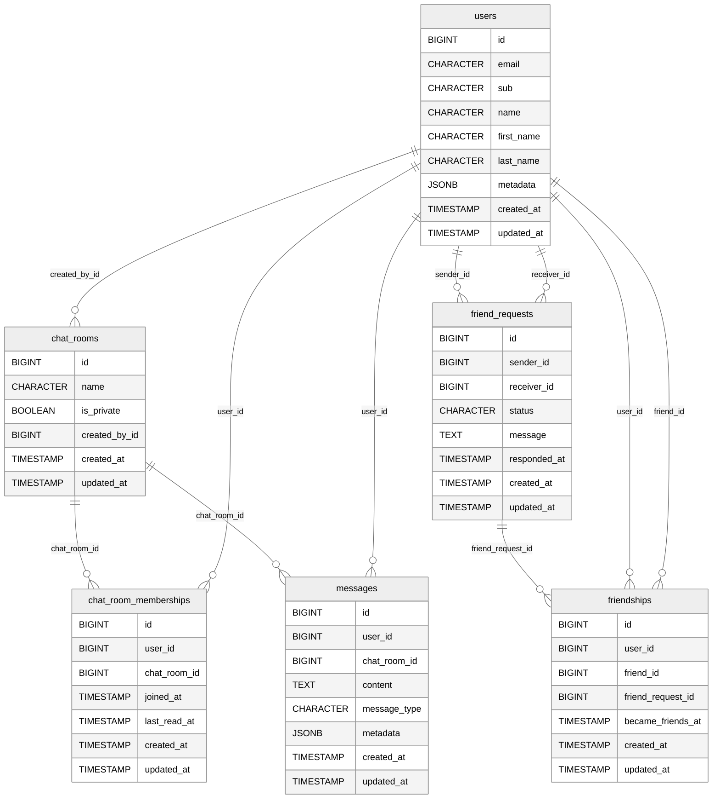

# JetChat (modul_223) – Projektdokumentation

> **Hinweis:** Diese Dokumentation wurde von Hand erstellt. Im Projekt selbst wurde *keine KI* eingesetzt (gemäss Vorgabe für die LB‑Dokus).

## 1. Executive Summary
**Ziel:** Echtzeit‑Chat‑App mit Freundesverwaltung, privaten Chats (1:1) und Live‑Status (Presence).
**Stack:** Ruby on Rails 8 (ActionCable), PostgreSQL, OAuth 2.0 mit Zitadel (JWT), SolidQueue für Jobs, Docker/Kamal für Deploy.
**Nutzer:** Registrierte Benutzer melden sich via Zitadel an, sehen Freunde/Anfragen und chatten in privaten Räumen.

## 2. Architekturüberblick
- **Rails MVC** mit klassischen REST‑Controllern (HTML/JSON) und **ActionCable** Channels für Live‑Funktionen.
- **Auth:** Zitadel (OAuth 2.0 / OIDC). JWT wird serverseitig verifiziert.
- **Echtzeit:** Channels für Presence, ChatRoom und Benachrichtigungen.
- **Jobs:** SolidQueue für asynchrone Aufgaben (z. B. Broadcasts, Aufräumjobs).
- **Assets:** Propshaft; schlanke, klassische CSS‑Views.

## 3. Datenmodell (ERM)
Die folgenden Tabellen bilden die Kern‑Domäne ab: `users`, `friend_requests`, `friendships`, `chat_rooms`, `chat_room_memberships`, `messages`.

### 3.1 Mermaid‑Diagramm (kopierbar für mermaid.live)

> Optionales Bild (PNG) der ERD‑Skizze liegt im Repo/Artefakt und kann fuer Praesentationen verwendet werden.

### 3.2 Beziehungen in Worten
- **User – FriendRequest:** 1 Nutzer kann viele Anfragen senden oder erhalten.
- **User – Friendship:** Bidirektionale Freundschaft ueber `user_id` und `friend_id` (jeweils viele zu 1).
- **ChatRoom – Membership:** Viele User pro Raum; jede Membership gehoert genau zu 1 Raum/1 User.
- **ChatRoom – Message:** Viele Nachrichten pro Raum; jede Nachricht gehoert zu 1 User und 1 Raum.
- **ChatRoom.created_by_id:** Ersteller des Raumes (1 User → viele Raeume).

## 4. Controller
### 4.1 AuthController
- **Aufgabe:** OAuth‑Callback, Login/Logout, Tokenverarbeitung.
- **Wichtig:** Verifikation von JWT (Zitadel), Setzen der Session/Cookies. Fehlerfeedback bei invalider Signatur/Expiry.

### 4.2 DashboardController
- **Aufgabe:** Startseite nach Login; zeigt Freundesstatus, offene Anfragen, letzte Chats.
- **Actions:** `index` (SSR).

### 4.3 FriendsController
- **Aufgabe:** Freundesverwaltung und Suche.
- **Actions (typisch):** `index` (Liste), `create`/`destroy` (Folgen/Entfernen), ggf. `search`.

### 4.4 FriendRequestsController
- **Aufgabe:** Anfragen erstellen/annehmen/ablehnen.
- **Actions:** `create`, `update` (accept/decline), `index` (eingehend/ausgehend).

### 4.5 ChatRoomsController
- **Aufgabe:** Raumverwaltung (1:1‑Raeume pro Freundschaft).
- **Actions:** `show` (Nachrichtenansicht), `create` (falls noch kein Raum fuer Freundschaft existiert).

### 4.6 MessagesController
- **Aufgabe:** Nachrichten anlegen; Broadcast ueber ActionCable; Read‑Status aktualisieren.
- **Actions:** `create` (POST), optional `index` (Nachladungen/SSR).

> **Validierung/Policies:** Bei allen Actions pruefen: eingeloggter User, Besitz der Freundschaft/Raum‑Mitgliedschaft.

## 5. Channels (ActionCable)
- **PresenceChannel:** Meldet online/offline, tippt‑gerade usw. (mit TTL).
- **ChatRoomChannel:** Live‑Nachrichten, Typing‑Events und Read‑Receipts in einem Raum.
- **NotificationsChannel:** Globale Benachrichtigungen (z. B. neue Freundesanfrage).

**Nachrichtenformat (Beispiel):** `{type: "message.created", roomId, message: {...}}`

## 6. Models (Kurzuebersicht)
- **User:** OAuth‑Felder (`sub`, `email`), Anzeigename, optionale Metadaten. Assoziationen zu `friendships`, `friend_requests`, `chat_room_memberships`, `messages`.
- **FriendRequest:** `sender_id`, `receiver_id`, `status` (pending/accepted/declined), `responded_at`.
- **Friendship:** Referenz auf `friend_request`, sowie `user_id`/`friend_id`.
- **ChatRoom:** `name`, `is_private`, `created_by_id`. Hat viele `memberships` und `messages`.
- **ChatRoomMembership:** verbindet `user` und `chat_room`, haelt `last_read_at`.
- **Message:** `content`, `message_type`, `metadata`, gehoert zu `user` und `chat_room`.

## 7. Sicherheit & Auth
- **Login/Callback:** Zitadel OAuth 2.0 / OIDC.
- **JWT‑Pruefung:** Signatur, Ablaufzeit, Audience/Issuer.
- **Rollen/Policies:** Zugriff nur auf eigene Ressourcen; kein Zugriff auf fremde Raeume/Anfragen.
- **CSRF:** Rails‑Standard fuer nicht‑API‑Routes, Token fuer Formularaktionen.

## 8. Jobs & Performance
- **SolidQueue:** Auslagerung von Broadcasts/Aufraumen.
- **N+1 vermeiden:** Eager Loading auf Listen (Freunde, Messages).
- **Indizes:** auf FKs (`user_id`, `chat_room_id`, `friend_id`, `sender_id`, `receiver_id`).

## 9. Views & UX
- **SSR‑Views:** Mobile‑freundlich, Toast‑Benachrichtigungen, Badge fuer ungelesene Nachrichten.
- **Typing‑Indicator & Presence:** Direkt ueber Channels.

## 10. Setup (Entwicklung)
1) `.env` mit DB und OIDC‑Werten (Zitadel) fuellen.
2) `bundle install`
3) `bin/rails db:setup` (oder `db:create db:migrate`)
4) `bin/dev` bzw. `bin/rails s` starten
5) ActionCable testen (Konsole/Browser zwei Sessions)

## 11. Deployment (Docker/Kamal)
- **Dockerfile** + Compose; ENV fuer DB, Cable, OIDC, SECRET_KEY_BASE setzen.
- **Reverse Proxy:** WS‑Upgrade fuer `/cable` erlauben.

## 12. Tests (Idee)
- **Model‑Tests:** Validierungen, Assoziationen.
- **System‑Tests:** Freund werden, Chat schreiben, Badge fuer ungelesen.
- **Channel‑Tests:** Broadcasts, Berechtigungen.

## 13. Aufwand & Reflexion
- **Schwierig:** Echtzeit‑Teile (Presence, Typing) und OIDC‑Flow.
- **Lernen:** Saubere Trennung von REST (CRUD) und WebSocket‑Events; Authorisierung an allen Kanten.
- **Soll/ Ist:** Von einfacher Chat‑App zu vollwertiger Freundesverwaltung mit 1:1‑Raeumen.

---
*Stand: Projektmodul 223*

